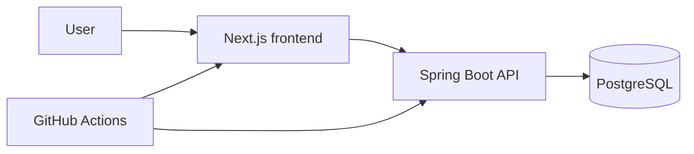

# Architecture notes

The first release separates the browser interface, REST API and relational database. Each component has an explicit boundary and can be deployed or scaled independently.

The local environment uses Docker Compose. The public demo will use free managed resources; a later phase introduces Helm and GitOps without changing the application boundaries.
